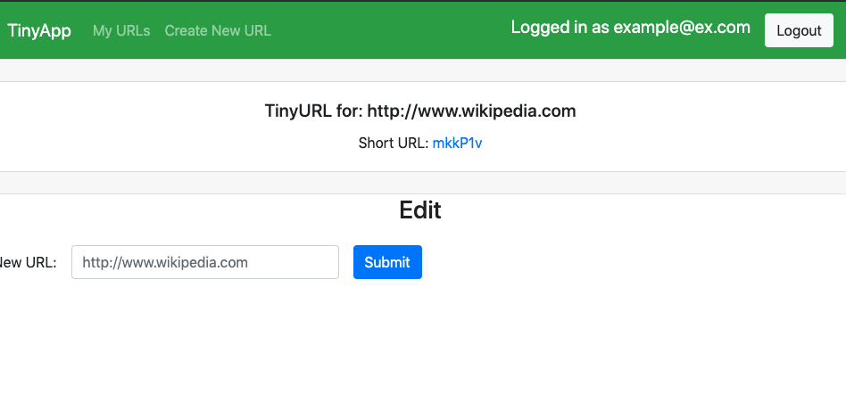
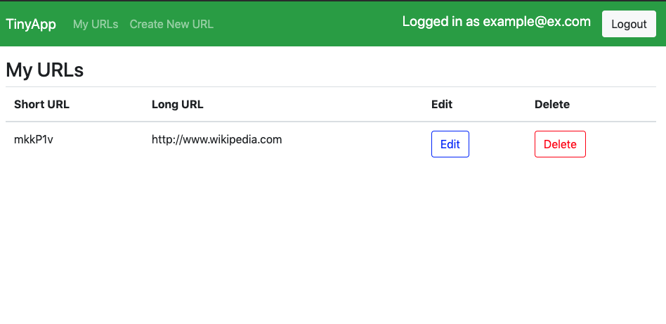
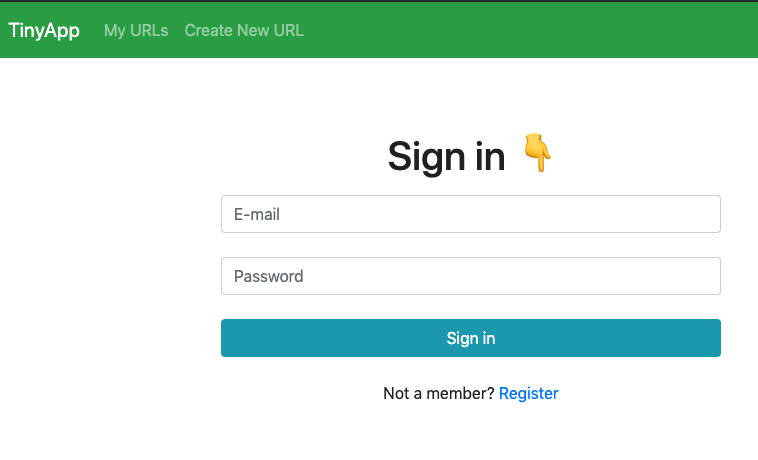

# TinyApp Project

TinyApp is a full stack web application built with Node and Express that allows users to shorten long URLs (à la bit.ly).

## Final Product

## Dependencies

- Node.js
- Express
- EJS
- bcrypt
- body-parser
- cookie-session

## Getting Started

- Install all dependencies (using the `npm install` command).
- Run the development web server using the `node express_server.js` command.
- Open the browser at `localhost:8080/` and register first!
**If the server is restarted, cookies are not automatically deleted but the user database is (for the sake of this activity). If a feature is not behaving properly, inspect the browser and delete the cookie to start over.**
